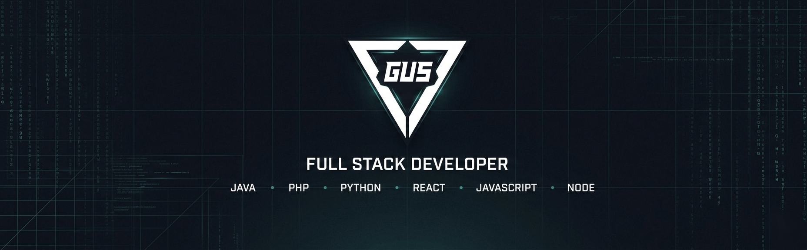

  

 

<h1 align="center">GUSTAVO DEV</h1>

  <strong>ETEC • FATEC</strong> | Systems Analysis & Development 
  Building scalable web applications, SaaS platforms, and developer tools

 

---

## 🟦 My Journey

|                               🎓 **Education**                               | 📚 **Academic Experience**                                                                          |
| :--------------------------------------------------------------------------: | --------------------------------------------------------------------------------------------------- |
| **Internet Informatics Technician** 🎯 ETEC (Integrated with High School) | Technical course focused on web development, computer fundamentals, and market practices            |
|     **Systems Analysis and Development** 🎓 FATEC (Currently Enrolled)    | Higher education with emphasis on software engineering, system architecture, and project management |

---

## 🟦 Tech Stack

### 🔷 Core

### 🔷 Frontend

### 🔷 Backend & Databases

### 🔷 Cloud, DevOps & Architecture

### 🔷 AI & LLMs

### 🔷 Tools & Practices

---

## 🟦 GitHub Analytics

---

## 🟦 Connect With Me

---

## 💻 Currently Building

⚓ **GitGraph**: SaaS platform for GitHub repository analytics and insights

🤖 **AI Chatbot Integrations**: Conversational automation tools and intelligent chatbot systems

🌐 **Full-Stack Applications**: Modern web apps built with Next.js, TypeScript, and scalable architectures

 

 

<b>💼 Seeking Full Stack Developer opportunities</b> 
Ready to contribute to innovative teams and projects

  <picture>
    <source media="(prefers-color-scheme: dark)" srcset="https://raw.githubusercontent.com/gustaavo-404/gustaavo-404/output/github-contribution-grid-snake-dark.svg">
    <source media="(prefers-color-scheme: light)" srcset="https://raw.githubusercontent.com/gustaavo-404/gustaavo-404/output/github-contribution-grid-snake.svg">
    
  </picture>

 

